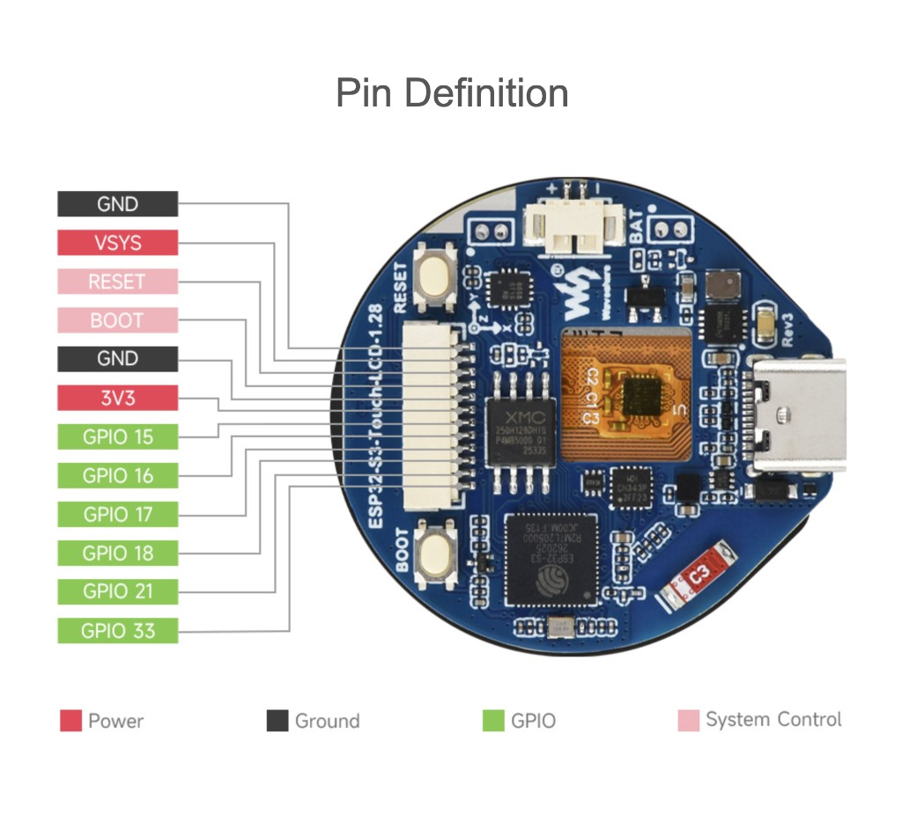

# Waveshare ESP32-S3-Touch-LCD-1.28 — SH1.0 pinout & u-blox NEO-M8 GPS

PlatformIO env: `waveshare-esp32-s3-touch-lcd-1` · Firmware GPS UART: **UART2**, **115200 8N1**, **GPIO16 (RX)** / **GPIO17 (TX)** on the SH1.0 connector ([`main/board_pins.h`](../main/board_pins.h)).

## SH1.0 connector pinout

Left-edge **12-pin SH1.0** FPC (pin 1 at top, toward RESET button). Matches Waveshare “Pin Definition” diagram.



| Pin | Label   | Type            | Notes |
|-----|---------|-----------------|-------|
| 1   | GND     | Ground          | Common ground for GPS and other peripherals |
| 2   | VSYS    | Power in        | **5 V** board input (do not use as GPS supply from the module) |
| 3   | RESET   | System control  | Board reset (not GPS reset) |
| 4   | BOOT    | System control  | Strap / download mode with RESET |
| 5   | GND     | Ground          | |
| 6   | **3V3** | Power out       | **3.3 V** — use for NEO-M8 VCC (within module spec) |
| 7   | GPIO15  | GPIO            | Free (not used by this firmware for GPS) |
| 8   | **GPIO16** | GPIO         | **UART2 RX** — connect to **GPS TX** |
| 9   | **GPIO17** | GPIO         | **UART2 TX** — connect to **GPS RX** |
| 10  | GPIO18  | GPIO            | Free |
| 11  | GPIO21  | GPIO            | Free |
| 12  | GPIO33  | GPIO            | Free |

### Legend (Waveshare diagram)

| Color   | Meaning        |
|---------|----------------|
| Red     | Power          |
| Dark grey | Ground       |
| Green   | GPIO           |
| Pink    | System control |

Other board interfaces (LCD SPI, touch I2C, USB-UART on GPIO43/44) are documented in [ESP32-S3-Touch-LCD-1.md](../ESP32-S3-Touch-LCD-1.md).

## NEO-M8 (u-blox) wiring

Use a **3.3 V** NEO-M8N (or M8T) breakout with **3.3 V UART logic**. Cross TX/RX between module and ESP32.

| NEO-M8 breakout | SH1.0 / ESP32-S3 | Direction |
|-----------------|------------------|-----------|
| **VCC** / 3V3   | Pin **6 — 3V3**  | Power (typ. 20–25 mA; avoid VSYS for the module) |
| **GND**         | Pin **1** or **5 — GND** | |
| **TX** (GPS → host) | Pin **8 — GPIO16** | GPS transmits → ESP receives |
| **RX** (host → GPS) | Pin **9 — GPIO17** | ESP transmits → GPS receives |

Optional module pins (not required for NMEA in this demo):

| NEO-M8 pin | Suggestion |
|------------|------------|
| PPS        | Leave unconnected unless you add PPS handling in firmware |
| RESET      | Leave floating or tie per breakout schematic (many boards have onboard reset) |
| V_BCKP     | Leave as on breakout (coin cell / supercap if populated) |

### Wiring sketch

```text
NEO-M8N          SH1.0 (Waveshare 1.28)
--------         ---------------------
VCC      ------> 3V3  (pin 6)
GND      ------> GND  (pin 1 or 5)
TX       ------> GPIO16 (pin 8)   ESP UART2 RX
RX       <------ GPIO17 (pin 9)   ESP UART2 TX
```

## Firmware & baud rate

- Pins and port: `BOARD_GPS_UART_PORT` = `UART_NUM_2`, `BOARD_GPS_RXD_PIN` = 16, `BOARD_GPS_TXD_PIN` = 17.
- UART: **115200**, 8N1, no flow control.
- On boot the project sends `$PAIR050,...` (Quectel LC76G rate command). **u-blox ignores it**; the module still outputs default NMEA if baud and wiring are correct.

Many NEO-M8 breakouts ship at **9600 baud**. If the serial monitor shows RX bytes but **no `$` NMEA lines**, set the module to **115200** (recommended):

1. **u-center** (u-blox): connect USB–UART adapter to the GPS module, set port baud to current rate, then *View → Configuration View → PRT (Ports)* → UART1 baud **115200**, apply to flash.
2. Or send UBX **CFG-PRT** / **CFG-CFG** once at 9600, then reboot and use 115200 on the ESP32.

Valid fix for the Osmo dashboard path: RMC status `A` and GGA fix quality ≥ 1 (see project Q&A).

## Build & test

```bash
pio run -e waveshare-esp32-s3-touch-lcd-1 -t upload
pio device monitor -e waveshare-esp32-s3-touch-lcd-1
```

Use `/dev/cu.wchusbserial*` for upload/monitor (CH343), not `usbmodem*`. Place the GPS antenna with a clear sky view; indoor fixes can take several minutes.

## Related

- [ESP32-S3-Touch-LCD-1.md](../ESP32-S3-Touch-LCD-1.md) — full board pin table and display pins
- [Waveshare wiki — ESP32-S3-Touch-LCD-1.28](https://www.waveshare.com/wiki/ESP32-S3-Touch-LCD-1.28)
- [u-blox NEO-M8 product summary](https://www.u-blox.com/en/product/neo-m8-series)
